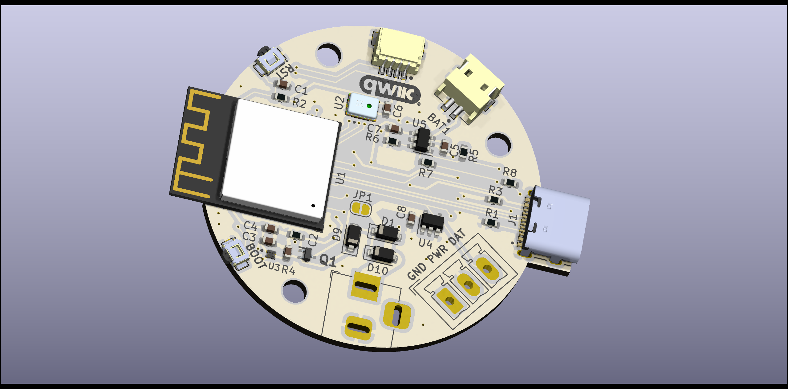
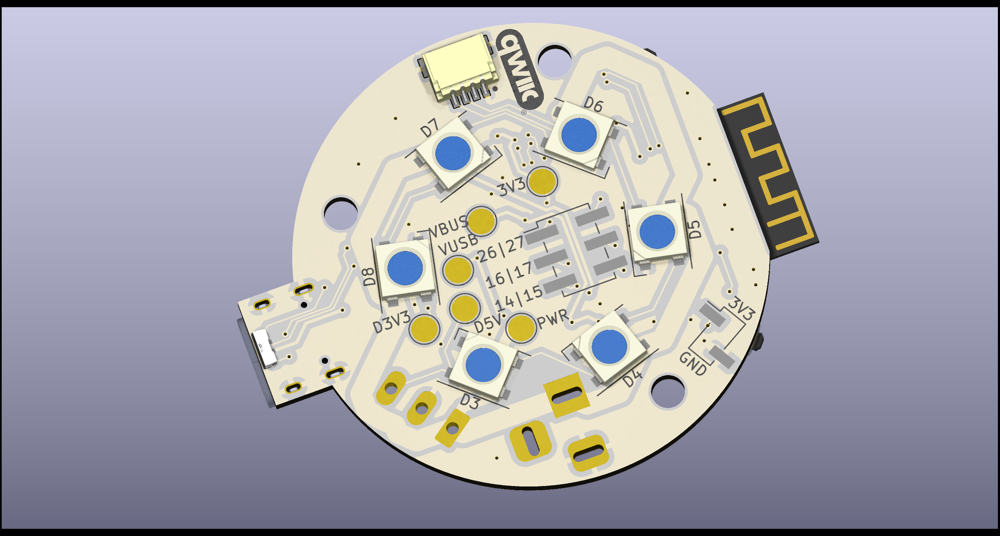

# Look At My Shiny Crystal Balls!
Watch the explaner video [here](https://www.youtube.com/watch?v=1-Rm0mgg2RI).

I got some of these [crystal balls](https://s.click.aliexpress.com/e/_DDdvNqJ) from AliExpress for Christmas.

The base is pretty simple, it's just some LEDs and resistors connected to the 5v USB power supply.

So, I decided to make something a bit more sophisticated.

It's based around an ESP32-S3-Mini which means it can run the popular WLED firmware.

It's a pretty compact PCB.

